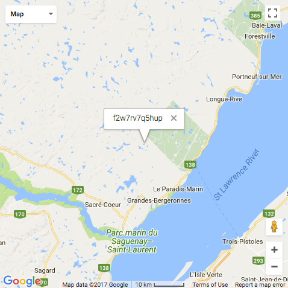
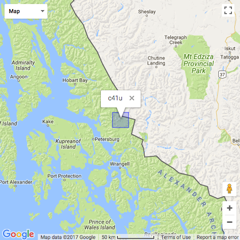
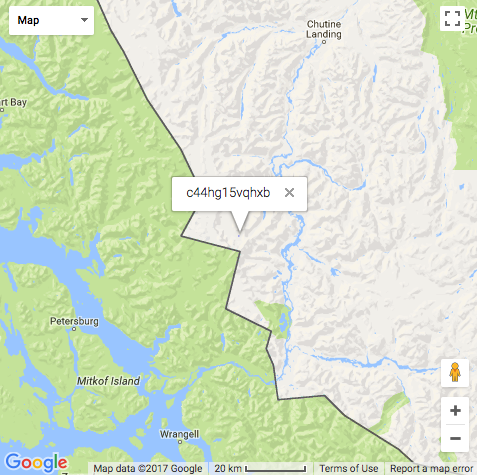
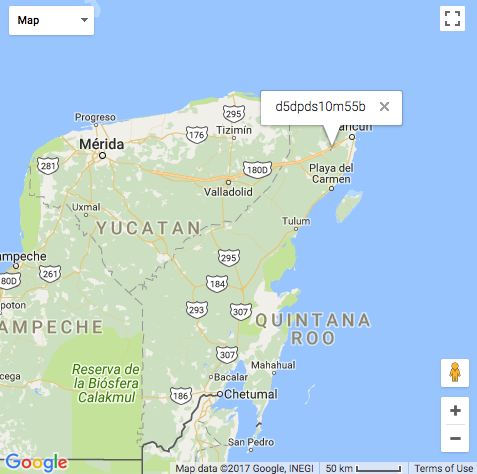
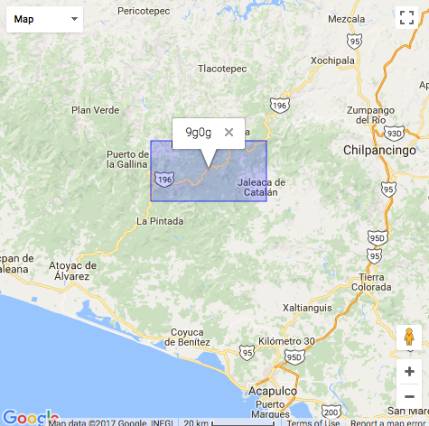
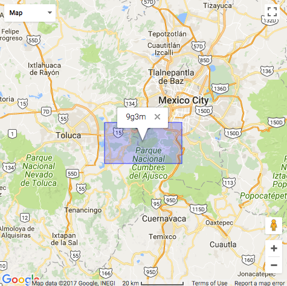
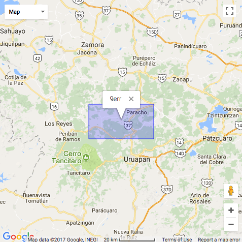
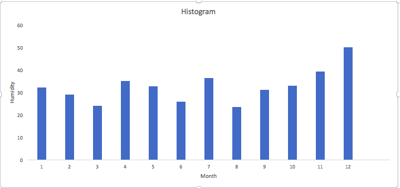
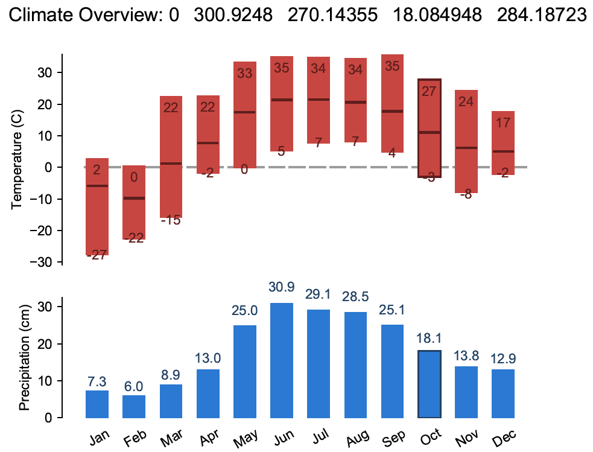

# Project 2 - Spatiotemporal Analysis with MapReduce

This repository includes starter files and a sample directory structure. You are welcome to use it or come up with your own project structure.

Project Specification: https://www.cs.usfca.edu/~mmalensek/courses/cs686/projects/project-2.html

# Deliverables

The project specification defines several questions that you will answer with MapReduce jobs. You should edit this document (README.md) with your answers as you find them, including figures, references, etc. This will also serve as a way of tracking your progress through the milestones.

## Deliverable I

Responses go here.

#### WARM UP:

**(1)How many records are in the dataset:**

    323759744

**(2)Top geohashes that have snow depths greater than zero for the entire year:**

Geohash:            Average snow depths

f2w7rv7q5hup :	7.64520774

c41uhb4r5n00 :	2.18433252

c41ueb1jyypb :	2.184330561

c41uxkww12rz :	2.026163066

c44hg15vqhxb :	2.024345323

**(3)Highest temperature timestamp and geohash**

TimeStamp:1440266400000, 

Geohash:d5dpds10m55b, 

Temperature:331.39062 Kelvin

To Human Readable:

Time: Saturday, August 22, 2015 6:00:00 PM GMT

Geohash map:

Temperature: 58.24062 Celsius

This temperature is not anomaly.

#### ANALYSIS:

**(1) Where are you most likely to be struck by lightning? Use a precision of 4 Geohash characters and provide the top 3 locations.**

Geohash--times

9g0g--2280

9g3m--2271

9err--2237

**(2) What is the driest month in the bay area? This should include a histogram with data from each month.**

Jan:	    32.104645

Feb:	    28.9719

Mar:	    24.100344

Apr:	    34.981876

May:	    32.672264

June:	    25.806923

Jul:	    36.241917

Aug:	    23.547655

Sep:	    31.077251

Oct:	    32.990948

Nov:	    39.13976

Dec:	    49.94359

**(3) Travel Agency -- Best time of 5 places**

**Amarillo** best day is 2015/10/18, since the wind speed is the minimum of the year which is 0.13040408, and it is not raining.

**Beverly Hills** best time :
Based on least precipitation:

    2015/06/18	cloud:0.0	pricipitation:10.165001

    2015/02/14	cloud:0.0	pricipitation:10.378329

    2015/03/27	cloud:0.0	pricipitation:10.504482

    2015/10/30	cloud:0.0	pricipitation:10.510426

Based on appropriate cloud to avoid overly shining:

    2015/11/21	cloud:10.0	pricipitation:11.260824

    2015/05/21	cloud:10.0	pricipitation:18.190544

    2015/06/20	cloud:12.0	pricipitation:10.538406

    2015/05/01	cloud:12.0	pricipitation:11.919537

    2015/07/27	cloud:12.0	pricipitation:18.992275

**Miami** best time:

No lightning and less precipitation:

    2015/02/18	precipitation:4.796525

    2015/02/19	precipitation:6.3019037

    2015/01/28	precipitation:6.6647477

    2015/02/14	precipitation:6.7701597

**Vail Ski Resort** best day is 2015/03/24 since the visibility value is maximum of the year wighi is 24307.436, and the snow coverage is 100%.
**Yellow Stone National Park** best times:

Criteria are "no rain", "no freezing rain", "no snow" and great visibilities which is above the threshold of 22000.

    2015/10/04	visibility:24235.344

    2015/03/06	visibility:24229.076

    2015/02/01	visibility:24228.746

    2015/02/16	visibility:24228.299

    2015/02/06	visibility:24227.873

**(4) Solar wind farm top 9 places:**

_Based on part of the Sample dataset._

**Solar:**

No.1

    9xmq1
    wind_gust_average = 10.5430324
    cloud_coverage_average = 0.333888889 = 33.4%

No.2
    
    9xmm9	
    wind_gust_average = 11.54925475	
    cloud_coverage_average = 0.337307692 = 33.7%

No.3
    
    9xmnt		
    wind_gust_average = 10.7876619
    cloud_coverage_average = 0.338043478 = 33.8%
    
**Wind:**

No.1

    9xkzp
    wind_gust_average = 11.81404335	    
    cloud_coverage_average = 0.440560748 = 44%

No.2
    
    9xkzh	
    wind_gust_average = 11.61057606	
    cloud_coverage_average = 0.493027523 = 49.3%
    
No.3
    
    9xmm9
    wind_gust_average = 11.54925475	    
    cloud_coverage_average = 0.337307692 = 33.7%

**Combination:**

No.1

    Because it ranks within top 3 of the other criteria:
    9xmm9
    wind_gust_average = 11.54925475	    
    cloud_coverage_average = 0.337307692 = 33.7%

No.2

    9xmnd	
    wind_gust_average = 11.24528372	
    cloud_coverage_average = 0.340645161 = 34%
    
No.3
    
    fd5jt	
    wind_gust_average = 10.96862128
    cloud_coverage_average = 0.356421053 = 35.6%

**(5)Given a Geohash prefix, create a climate chart for the region. This includes high, low, and average temperatures, as well as monthly average rainfall (precipitation).**

Given Geohash: dp6t, 

Location: South Bend, Indiana

